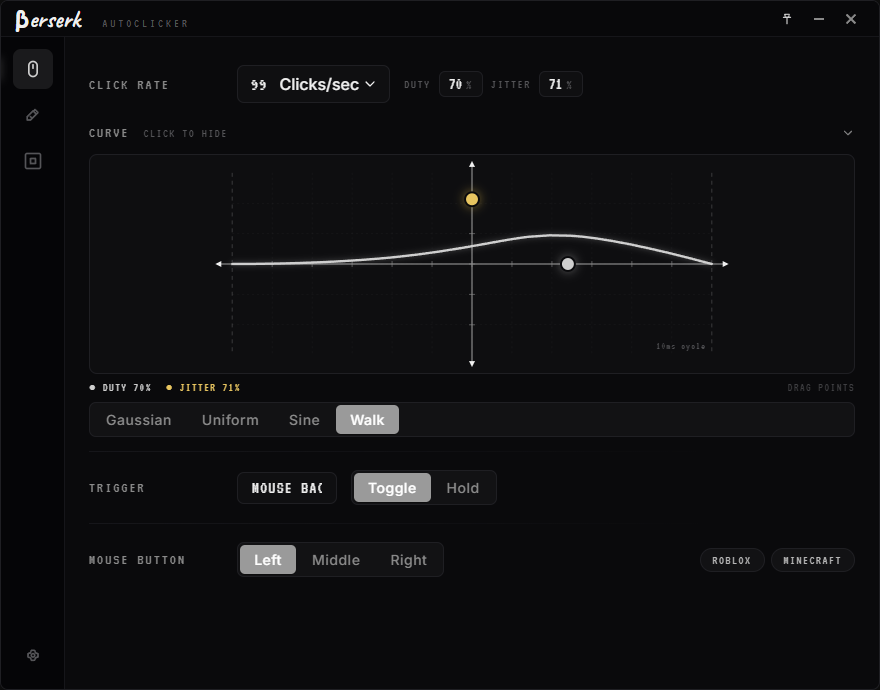
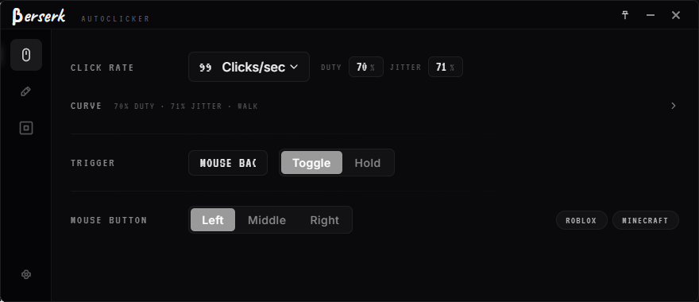
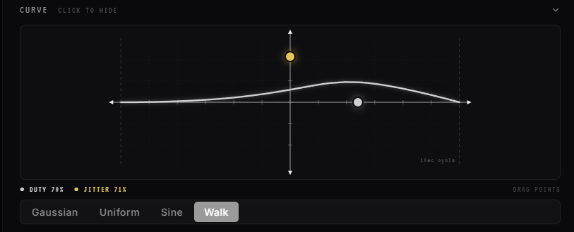
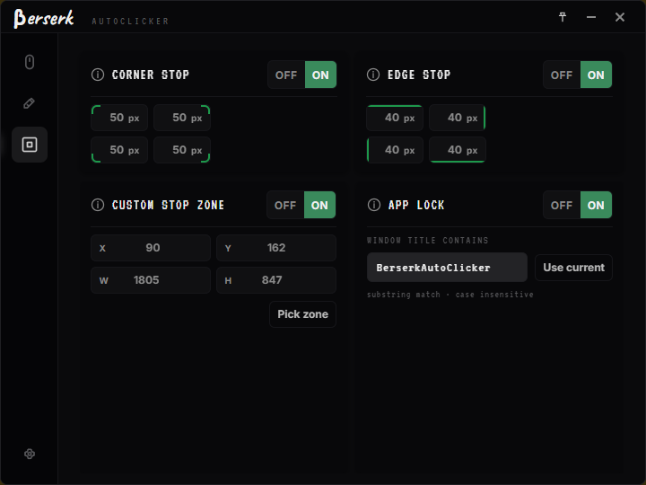
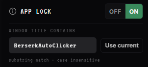
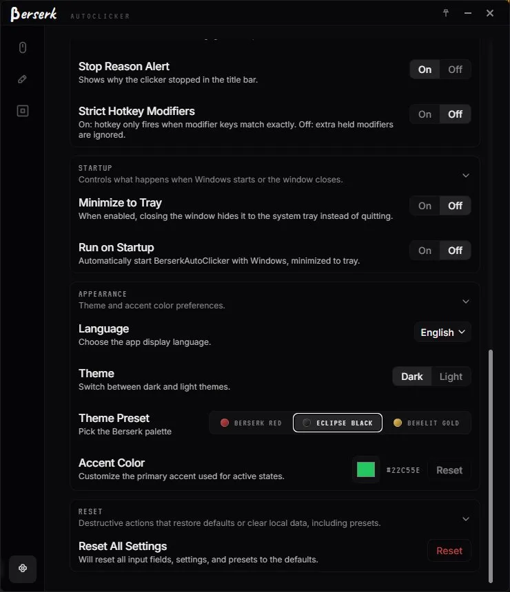

# Berserk Auto Clicker

Made by and for Berserk Group. First public release on GitHub starts at version 2.6.7.

A Windows-first desktop autoclicker focused on accuracy, speed and a clean interface. Built with Tauri 2, Rust and React.

<p align="center">
  
</p>

## Install

Grab the installer from the [latest release](https://github.com/gagga1/Berserk-AutoClicker/releases/latest). The app installs to `%localappdata%\BerserkAutoClicker`. Settings live in `%appdata%\BerserkAutoClicker`.

## Features

<table>
<tr>
<td width="320"></td>
<td>

### Simple panel

Click rate in CPS or any other unit. Hotkey with full modifier combo support. Toggle or Hold mode. Button selector. Game presets one click away.

</td>
</tr>
<tr>
<td width="320"></td>
<td>

### Click curve

Math-style graph with two draggable control points. Red dot sets duty cycle on the X axis. Gold dot sets jitter on the Y axis. Pick the timing distribution: Gaussian, Uniform, Sine, Walk.

</td>
</tr>
<tr>
<td width="320"></td>
<td>

### Safety zones

Edge and corner exclusion. Custom rectangular zones drawn directly on screen with the Pick Zone tool, like the Windows snipping flow. Multi monitor handled correctly.

</td>
</tr>
<tr>
<td width="320"></td>
<td>

### App lock + window profiles

Restrict clicking to a specific window. Bind saved presets to window titles so opening Minecraft loads your PvP preset and switching to Roblox swaps configs automatically.

</td>
</tr>
<tr>
<td width="320"></td>
<td>

### Floating HUD

Tiny always-on-top widget with live CPS and click count. Drag anywhere. Auto shows on run, hides when stopped. Works over borderless windowed games.

</td>
</tr>
<tr>
<td width="320"></td>
<td>

### Themes

Three preset palettes ship in. Berserk Red is the default. Eclipse Black runs darker. Behelit Gold pulls toward warm browns. Light mode also available.

</td>
</tr>
</table>

Other niceties: sequence clicking with positional targets, named user presets, animated run indicator in the titlebar, optional start and stop sounds, system tray, optional autostart with Windows, local stats (total clicks, total time, average CPU).

## Build from source

```powershell
git clone https://github.com/gagga1/Berserk-AutoClicker.git
cd Berserk-AutoClicker
npm install
npm run dev          # hot reload
npm run build        # release exe + nsis installer
```

Requires Node 20+, Rust via rustup, MSVC Build Tools, Windows `x86_64-pc-windows-msvc` toolchain.

## License

GPL 3.0. See [LICENSE](LICENSE).
