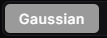
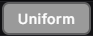
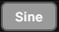
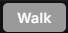

# Berserk Auto Clicker

Made by and for Berserk Group. First public release on GitHub starts at version 2.6.7.

A Windows-first desktop autoclicker focused on accuracy, speed and a clean interface. Built with Tauri 2, Rust and React.

<p align="center">
  
</p>

## Install

Grab the installer from the [latest release](https://github.com/gagga1/Berserk-AutoClicker/releases/latest). The app installs to `%localappdata%\BerserkAutoClicker`. Settings live in `%appdata%\BerserkAutoClicker`.

## Features

<table>
<tr>
<td width="320"></td>
<td>

### Simple panel

Click rate in CPS or any other unit. Hotkey with full modifier combo support. Toggle or Hold mode. Button selector. Game presets one click away.

</td>
</tr>
<tr>
<td width="320"></td>
<td>

### Click curve

Math-style graph with two draggable control points. Red dot sets duty cycle on the X axis. Gold dot sets jitter on the Y axis. Pick the timing distribution: Gaussian, Uniform, Sine, Walk.

</td>
</tr>
<tr>
<td width="320"></td>
<td>

### Safety zones

Edge and corner exclusion. Custom rectangular zones drawn directly on screen with the Pick Zone tool, like the Windows snipping flow. Multi monitor handled correctly.

</td>
</tr>
<tr>
<td width="320"></td>
<td>

### App lock + window profiles

Restrict clicking to a specific window. Bind saved presets to window titles so opening Minecraft loads your PvP preset and switching to Roblox swaps configs automatically.

</td>
</tr>
<tr>
<td width="320"></td>
<td>

### Floating HUD

Tiny always-on-top widget with live CPS and click count. Drag anywhere. Auto shows on run, hides when stopped. Works over borderless windowed games.

</td>
</tr>
<tr>
<td width="320"></td>
<td>

### Themes

Three preset palettes ship in. Berserk Red is the default. Eclipse Black runs darker. Behelit Gold pulls toward warm browns. Light mode also available.

</td>
</tr>
</table>

Other niceties: sequence clicking with positional targets, named user presets, animated run indicator in the titlebar, optional start and stop sounds, system tray, optional autostart with Windows, local stats (total clicks, total time, average CPU).

## Click style guide

Every clicker tool can spam clicks. The difference is how those clicks are spaced apart in time. Berserk gives you four distribution shapes for the timing jitter, and choosing the right one is what makes your pattern blend in or stand out.

<table>
<tr>
<td width="180"></td>
<td>

**Gaussian** is the default and the one you want most of the time. Click intervals fall on a bell curve, meaning most clicks land close to your base rate and only a few outliers stretch further. This is what real human input looks like under a microscope. If you're playing Minecraft PvP against a server with anti-cheat, this is the safest choice. Combined with moderate jitter (around 40 to 60 percent), it produces clean butterfly and jitter clicking patterns that read as natural.

</td>
</tr>
<tr>
<td width="180"></td>
<td>

**Uniform** spreads variation evenly across the entire range. Every value between minimum and maximum is equally likely. More robotic than Gaussian because real humans don't click in flat random patterns, but simpler and good enough for games that don't actively check distribution shape. Roblox auto farms, idle games, AFK trainers all run perfectly on Uniform. Pair it with low jitter (zero to 15 percent) for stable predictable output.

</td>
</tr>
<tr>
<td width="180"></td>
<td>

**Sine** wraps your click rate in a slow oscillation. The actual cps speeds up and slows down in waves over several seconds. Useful when you want the bot to mimic a player who's getting tired or pushing harder in waves. Drag clickers benefit from Sine because real drag clicking has natural rhythm peaks and dips. Recommended jitter is medium (30 to 50 percent), enough to add waveform variation without overwhelming the base rhythm.

</td>
</tr>
<tr>
<td width="180"></td>
<td>

**Walk** does a random walk where each interval drifts slightly from the previous one. Output is smooth and feels alive but the running average can drift fairly far from your base over time. This is the closest thing to organic input drift you'll get. Best for stealth scenarios where you want cps to look like a tired human slowly slowing down or a fresh human ramping up. Server-side detection that watches click variance over time has a very hard time flagging Walk patterns. Use moderate jitter (40 to 70 percent).

</td>
</tr>
</table>

### Pick by playstyle

| Playstyle | Distribution | Base CPS | Jitter | Mode |
|-----------|-------------|----------|--------|------|
| Minecraft PvP butterfly | Gaussian | 21 | 50% | Hold |
| Minecraft PvP jitter | Walk | 14 | 65% | Hold |
| Minecraft PvP drag | Sine | 22 | 40% | Hold |
| Roblox auto farm | Uniform | 18 | 0% | Toggle |
| Idle / AFK clicker | Uniform | 5 | 0% | Toggle |
| Anti-detection stealth | Walk | 10 | 60% | Toggle |

## Build from source

```powershell
git clone https://github.com/gagga1/Berserk-AutoClicker.git
cd Berserk-AutoClicker
npm install
npm run dev          # hot reload
npm run build        # release exe + nsis installer
```

Requires Node 20+, Rust via rustup, MSVC Build Tools, Windows `x86_64-pc-windows-msvc` toolchain.

## License

GPL 3.0. See [LICENSE](LICENSE).
